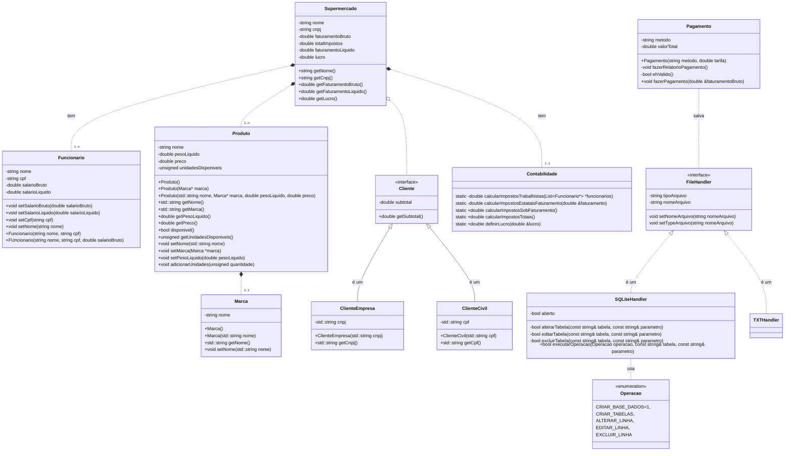

# Supermercado
Projeto simples para faculdade.

## Bibliotecas e dependências para compilar por código fonte
- zlib-devel: https://docs.oracle.com/en/graalvm/enterprise/20/docs/reference-manual/ruby/Installingzlib/
- tcl: https://sqlite.org/src/doc/trunk/doc/compile-for-unix.md
- sqlite3: Para sistemas baseados em RedHat: sudo dnf install sqlite-devel
- sqlite3: Para sistemas baseados em debian/ubuntu: sudo apt-get install libsqlite3-dev

## Impostos calculados

1. Contribuição Social sobre o Lucro Líquido (CSLL) -> 9%
2. PIS (Programa de Integração Social) -> 0.65%
3. COFINS (Contribuição para o Financiamento da Seguridade Social) -> 3%
4. Contribuições previdenciárias (Assumimos como o salário completo do funcionário, contratado em regime CLT)
5. IṔTU estimado: Tarifa de R$ 5000,00 ao ano.

## Desconto para empresas ou compras em atacado
Para empresas ou para compradores no atacado, cada produto terá 7.5% de desconto

## Diagrama de classe

